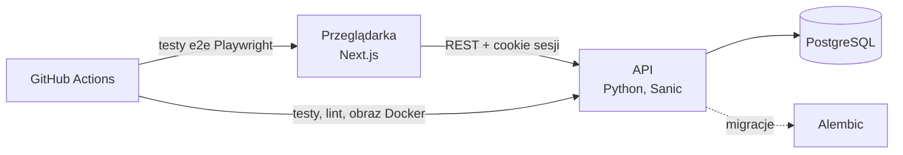
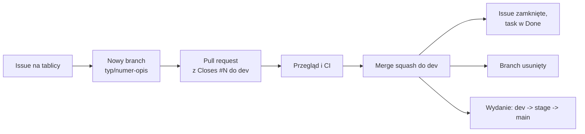

# WorthMyTime

**Otwarty projekt zespołowy: budujemy nowoczesną aplikację finansową z pomocą sztucznej inteligencji. Dołącz, rozwijaj umiejętności i dopisz do portfolio realny produkt.**

WorthMyTime to aplikacja do świadomego zarządzania pieniędzmi. Zaczęła się od jednego pomysłu: *ile godzin Twojej pracy kosztuje ten zakup?* Dziś to coraz pełniejsza aplikacja finansowa: budżet, wydatki, zobowiązania, cele i ostrzeżenia, które pomagają podejmować lepsze decyzje, zanim wydasz pieniądze.

Jednocześnie to **projekt do nauki i pracy w zespole**. Powstaje tak, jak powstają prawdziwe produkty: z backlogiem, przeglądem kodu, testami, migracjami, wydaniami przez środowisko testowe i wspólną odpowiedzialnością za jakość. Nie ma tu zadań "na pokaz": to, co zrobisz, trafia do działającej aplikacji.

> **Chcesz dołączyć?** Zacznij od [ONBOARDING.md](ONBOARDING.md): dostęp, uruchomienie lokalne, zasady commitów i wybór pierwszego zadania (etykieta `good first issue`). Zasady współpracy: [CONTRIBUTING.md](CONTRIBUTING.md).

## Dlaczego warto

- **Realny produkt, nie ćwiczenie.** Logika finansowa, konta użytkowników, bezpieczeństwo sesji, migracje bazy, CI i wydania. Rzeczy, o które pytają na rozmowach rekrutacyjnych.
- **Praca zespołowa od pierwszego dnia.** Issue, branch, pull request, code review, scalanie przez `dev` → `stage` → `main`. Uczysz się procesu, a nie tylko składni.
- **Wpis do portfolio, który da się sprawdzić.** Repozytoria są publiczne, a Twoje commity i pull requesty są podpisane Twoim kontem GitHub. Rekruter widzi dokładnie, co zrobiłeś.
- **AI jako narzędzie pracy.** Projekt powstaje z użyciem asystentów kodowania (np. Claude Code) i uczy, jak z nimi pracować dobrze: przeglądać, testować i brać odpowiedzialność za kod, który trafia do produktu. AI jest też kierunkiem rozwoju samej aplikacji.
- **Wpływ na kierunek.** Zespół jest mały, więc Twoje pomysły i decyzje (zapisywane w notatkach) realnie kształtują produkt.

## Co już działa

- **Cena w czasie pracy:** godziny, dni i miesiące pracy, udział w miesięcznej wypłacie, realna stawka (z dojazdem i kosztami pracy)
- **Plan budżetu:** podział dochodu na Potrzeby, Przyszłość, Cele i Przyjemności, ostrzeżenia, gdy zakup się nie mieści, maksymalna miesięczna wpłata
- **Wydatki:** rejestr, stałe wydatki dopisujące się same, dzienny limit i prognoza końca miesiąca
- **Zobowiązania:** kredyty i pożyczki z terminami rat i oznaczaniem opłaconych
- **Lista życzeń z okresem ostygnięcia** i **cele oszczędnościowe** z postępem
- **Centrum alertów:** kategorie na granicy budżetu, zbliżające się raty, cele po terminie
- **Konta i bezpieczeństwo:** sesja w ciasnym cookie, ochrona CSRF, limity żądań, zmiana hasła, usuwanie konta i eksport danych
- Historia, porównanie scenariuszy, udostępnianie wyniku, tryb "co jeśli", audyt subskrypcji

## Dokąd zmierzamy

Pełna lista jest na [tablicy projektu](https://github.com/orgs/worthmytime/projects/1). Przykłady kierunków:

- **Finanse osobiste:** poduszka bezpieczeństwa, stopa oszczędności, "bezpieczne do wydania", import wydatków z CSV banku, prognozy przepływów, inflacja stylu życia, wspólne budżety gospodarstwa domowego
- **Sztuczna inteligencja:** pomocnik, który podpowiada kategorie wydatków i tłumaczy ostrzeżenia, analiza nawyków wydatkowych, symulacje "co by było, gdyby" (koszt alternatywny)
- **Platforma:** wersje językowe i waluty, aplikacja instalowana na telefonie (PWA) z trybem offline, eksport do PDF, dokumentacja API, monitoring i środowisko testowe
- **Doświadczenie użytkownika:** kreator startowy, tryb demo, tryb prywatny, nowy wygląd według makiety

## Dla kogo i w jakiej roli

| Rola | Czym się zajmiesz | Technologie |
|---|---|---|
| Backend | API, logika finansowa, baza danych, bezpieczeństwo | Python 3.12, Sanic, SQLAlchemy (async), Alembic, PostgreSQL, pytest |
| Frontend | aplikacja webowa, wykresy, formularze, dostępność | Next.js (App Router), TypeScript, Tailwind v4, shadcn/ui, Recharts, Playwright |
| Jakość i testy | scenariusze testowe, testy e2e, przegląd błędów | Playwright, pytest |
| Dokumentacja i produkt | specyfikacje, diagramy, opisy wzorów, decyzje | Markdown, Mermaid |
| UX i projekt | makiety, spójność interfejsu, treści | Figma lub Claude Design |

Szukamy osób na każdym poziomie: od studentów po doświadczonych programistów. Zadania są podzielone na małe i duże, a każde ma opis i kryterium ukończenia.

## Jak dołączyć

1. Przeczytaj [ONBOARDING.md](ONBOARDING.md) i uruchom projekt lokalnie.
2. Wybierz zadanie z etykietą [`good first issue`](https://github.com/search?q=org%3Aworthmytime+label%3A%22good+first+issue%22+state%3Aopen&type=issues) albo [`help wanted`](https://github.com/search?q=org%3Aworthmytime+label%3A%22help+wanted%22+state%3Aopen&type=issues) i przypisz je sobie.
3. Otwórz pull request do `dev`. Dostaniesz przegląd i, po zielonych kontrolach, Twoja zmiana trafi do aplikacji.

Masz pytanie albo pomysł na funkcję? Utwórz issue albo napisz do właściciela projektu (`@poewer`). Prośbę o dostęp do organizacji też kieruj do niego.

## Jak to wygląda technicznie



| Repozytorium | Zawartość |
|---|---|
| [worthmytime-backend](https://github.com/worthmytime/worthmytime-backend) | REST API (Python, Sanic, SQLAlchemy, Alembic) |
| [worthmytime-frontend](https://github.com/worthmytime/worthmytime-frontend) | Aplikacja webowa (Next.js, Tailwind, shadcn/ui) |
| worthmytime-product (to repo) | Dokumentacja, diagramy, specyfikacje, makiety, onboarding |

W tym repozytorium: dokumenty produktowe i specyfikacje (np. `WorthMyTime_MVP.md`, `WorthMyTime_Budget_Model.md`), diagramy (Mermaid), notatki o decyzjach i odnośniki do makiet. Proponowana struktura (luźna, można ją zmieniać):

```
docs/        opisy funkcji, wzory, założenia
diagrams/    diagramy i ich źródła
specs/       specyfikacje i modele (MVP, model budżetu)
decisions/   notatki o decyzjach
```

## Jak pracujemy

Każda zmiana przechodzi ten sam cykl: **issue = nowy branch = pull request = merge = zamknięcie taska = usunięcie brancha**.



1. Zadanie zaczyna się od issue na [tablicy projektu](https://github.com/orgs/worthmytime/projects/1).
2. Dla issue powstaje osobny branch `<typ>/<numer>-<opis>` (np. `docs/3-model-danych`), z `dev`, bez commitów prosto na `dev`, `stage` ani `main`.
3. Zmiany trafiają w pull requeście do `dev`, którego opis zawiera `Closes #<numer>`.
4. Po scaleniu (squash) issue zostaje zamknięte, zadanie trafia do Done, a branch jest usuwany.

### Gałęzie i wydania

| Gałąź | Rola | Kto scala |
|---|---|---|
| `main` | **produkcja** (z niej budujemy obraz i wdrażamy) | tylko właściciel (`poewer`) |
| `stage` | **testy przed produkcją**: tu sprawdzamy produkt przed wydaniem | tylko właściciel (`poewer`) |
| `dev` | **integracja**: tu deweloperzy scalają swoje zadania | każdy z uprawnieniem zapisu, po zielonych kontrolach |

Droga zmiany: `feature/...` -> `dev` -> `stage` -> `main`. Ta sama zasada obowiązuje w repozytoriach kodu; szczegóły w ich `CONTRIBUTING.md`.
