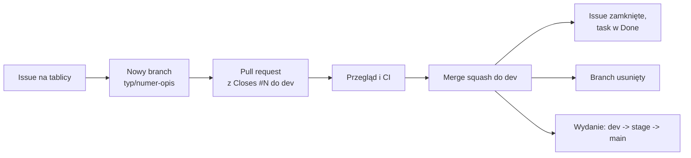

# WorthMyTime: produkt

Miejsce na dokumentację, diagramy i istotne pliki produktowe projektu WorthMyTime. Kod aplikacji jest w osobnych repozytoriach.

## Repozytoria

| Repozytorium | Zawartość |
|---|---|
| [worthmytime-backend](https://github.com/worthmytime/worthmytime-backend) | REST API (Python, Sanic, SQLAlchemy, Alembic) |
| [worthmytime-frontend](https://github.com/worthmytime/worthmytime-frontend) | Aplikacja webowa (Next.js, Tailwind, shadcn/ui) |
| worthmytime-product (to repo) | Dokumentacja, diagramy, specyfikacje, makiety |

Backlog i status zadań: [tablica projektu](https://github.com/users/poewer/projects/6).

## Co tu trafia

- dokumenty produktowe i specyfikacje (np. `WorthMyTime_MVP.md`, `WorthMyTime_Budget_Model.md`)
- diagramy (architektura, model danych, przepływy) najlepiej jako tekst (Mermaid) albo pliki źródłowe obok eksportu
- notatki o decyzjach (krótko: kontekst, decyzja, skutki)
- odnośniki i eksporty makiet

## Proponowana struktura

```
docs/        opisy funkcji, wzory, założenia
diagrams/    diagramy i ich źródła
specs/       specyfikacje i modele (MVP, model budżetu)
decisions/   notatki o decyzjach
```

Struktura jest luźna i można ją zmieniać, gdy będzie potrzeba.

## Jak pracujemy

Każda zmiana przechodzi ten sam cykl: **issue = nowy branch = pull request = merge = zamknięcie taska = usunięcie brancha**.



1. Zadanie zaczyna się od issue na [tablicy projektu](https://github.com/users/poewer/projects/6).
2. Dla issue powstaje osobny branch `<typ>/<numer>-<opis>` (np. `docs/3-model-danych`), z `dev`, bez commitów prosto na `dev`, `stage` ani `main`.
3. Zmiany trafiają w pull requeście, którego opis zawiera `Closes #<numer>`.
4. Po scaleniu (squash) issue zostaje zamknięte, zadanie trafia do Done, a branch jest usuwany.

## Gałęzie i wydania

| Gałąź | Rola | Kto scala |
|---|---|---|
| `main` | **produkcja** (z niej budujemy obraz i wdrażamy) | tylko właściciel (`poewer`) |
| `stage` | **testy przed produkcją**: tu sprawdzamy produkt przed wydaniem | tylko właściciel (`poewer`) |
| `dev` | **integracja**: tu deweloperzy scalają swoje zadania | każdy z uprawnieniem zapisu, po zielonych kontrolach |

Droga zmiany: `feature/...` -> `dev` -> `stage` -> `main`.

Ta sama zasada obowiązuje w repozytoriach [backend](https://github.com/worthmytime/worthmytime-backend) i [frontend](https://github.com/worthmytime/worthmytime-frontend); szczegóły w ich `CONTRIBUTING.md`.